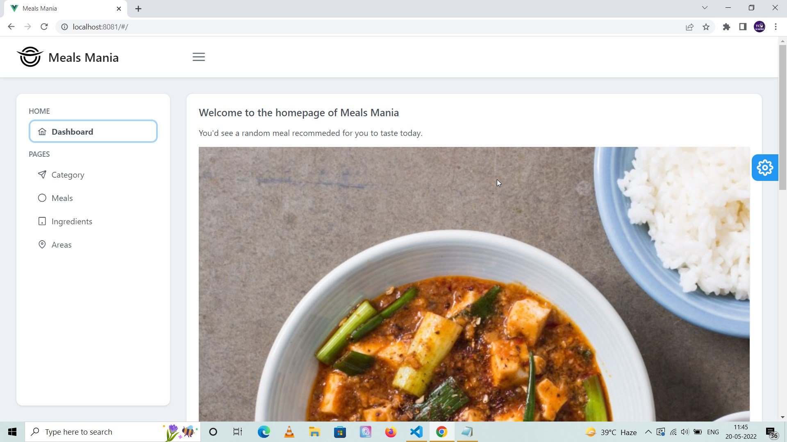

# Meals DB application using OpenMealsDB and PrimeVue ⚡️

## Project Briefing

This is a simple database application which integrates with an open source Meals database API <a href="https://www.themealdb.com/api.php"> https://www.themealdb.com/api.php </a> which I found recently. I have worked on other APIs created by this organization like CocktailAPI which has been a pleasant experience for me.

I wanted to experiment with the composition API and hooks based approach of API integration in Vue without the use of Vuex. I needed an open API which I can use as data source for this. I read about this open API in one of the blog posts I stumbled across lately and found this API to be apt for this.

As for UI, I try to experiment with different UI frameworks available for Vue. In this case, I went with PrimeVue. I found it relatively easy to get started with, has a wide range of components to offer and a nice color schema.

This project takes inspiration from Sakai Vue template created using PrimeVue. It is an open source admin template and can be found here https://github.com/primefaces/sakai-vue. It has multiple themes in it which can be changed through the button on the right side of the screen. It has various colors and their versions, light and dark themes are also available. That is the reason why 97% of the codebase of this project contains CSS.

Made with ❤️ by **[@apfirebolt](https://github.com/Apfirebolt/)**

Please find me [here](https://apgiiit.com/)

### PrimeVue Theme

Sakai Admin, which is used to built this uses the free Saga, Arya and Vela themes which are distributed within PrimeVue, however it can be used with any PrimeVue theme as well such as material, tailwind and bootstrap as layout colors are derived from the theme used via CSS variables.

### Dependencies

Following PrimeVue packages are used for this project.

```
{
    "primevue": "~3.12.2",
    "primeicons": "~5.0.0",
    "primeflex": "~3.1.2",
}
```
## Features

- Demonstrates use of various components of PrimeVue like Table, Dialogue, Cards and others.
- Modern architecture for Vue 3 which follows composition API for organizing various entities within a Vue page.

## Built With

* [Vue](https://reactjs.org/)
* [Vue 3 Composition API](https://vuejs.org/api/composition-api-setup.html/)
* [PrimeVue](https://www.primefaces.org/primevue/)

## Project setup

Simply install node modules for the Vue app and you're done at least for the development mode. Next step is running the application using the serve script and navigate to http://localhost:8080/ to view the application. That is it, in my case 8080 was occupied with Jenkins so the app was running on port 8081.

```
npm install
npm run serve
```

For production, build the frontend of the app. 

```
npm run build
npm run serve
```
## Issues

No issues as of now, would be added later if discovered.

## Future Updates

- Expect UI improvements in near future for this app as I get more familiar with PrimeVue.
- Docker deployment might be added later.

## Project Screenshots

Please find some of the screenshots of the application. The image below displays the homepage of the application, homepage is equipped with API call which would display a random meal for you at the beginning as well as every time you click on the button.



Meals page is shown below. Initially it loads all the meals starting with 'a', you can filter meals by name, category, first letter and area.


Meals page with filter dialogue. 


Shows all the meal categories available with description coming from the API.


